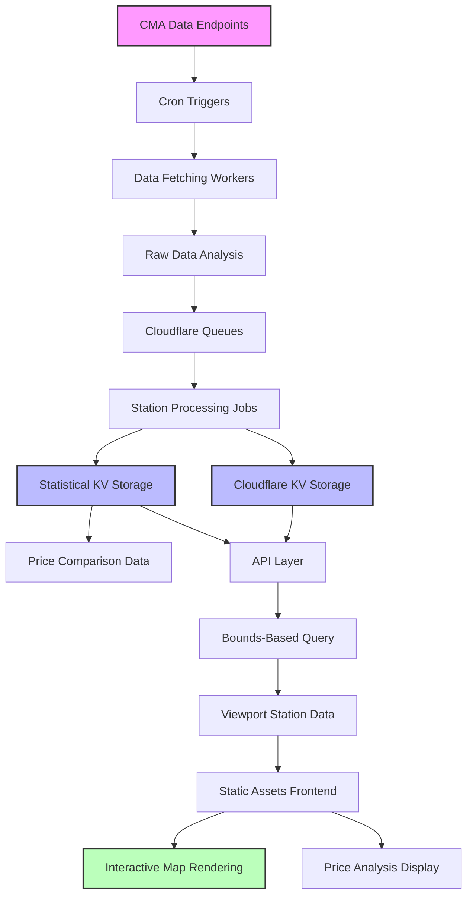

As fuel prices continue to fluctuate across the UK, finding the cheapest petrol and diesel stations has become more important than ever. That's why I built [fuelaround.me](https://fuelaround.me) – a comprehensive fuel price mapping and analysis tool designed specifically for UK drivers.

## The Data Foundation: CMA's Fuel Price Data Trial

fuelaround.me is built on top of the Competition and Markets Authority's Fuel Price Data Trial, an initiative that aimed to increase transparency in the UK fuel market by making station-level pricing data publicly available. This treasure trove of data provides up-to-date fuel prices from major retailers across the country, with some stations updating once daily and others updating multiple times throughout the day, making it the perfect foundation for a comprehensive price comparison tool.

The CMA's dataset includes pricing information from major fuel retailers, station locations, and regional coverage – everything needed to help drivers make informed decisions about where to fill up.

### Data Coverage Limitations

While the dataset is comprehensive for major retailers, there are notable gaps in coverage. The trial primarily includes large fuel retail chains, with independent garages largely absent from the data. This means:

- **Independent stations** like Merco-affiliated garages aren't represented in the pricing data
- **Recent acquisitions** create gaps – AppleGreen was purchased by new owners who haven't yet committed to data sharing
- **Local operators** and smaller chains often don't participate in the data sharing initiative

These limitations mean that in some areas, particularly rural locations where independent stations are common, the price comparison may not reflect all available options for drivers.

## Technical Architecture: Cloudflare Workers at Scale

The entire platform is built as a Cloudflare Worker, taking advantage of the platform's edge computing capabilities to deliver fast, global performance. Here's how the architecture breaks down:

### Data Pipeline with Cron Triggers and Queues

The heart of fuelaround.me is its data pipeline, orchestrated using Cloudflare's Cron Triggers and Queues:

- **Scheduled Data Fetching**: Cron Triggers run multiple times per day to fetch the latest fuel price data from various sources
- **Queue-Based Processing**: Cloudflare Queues handle the heavy lifting of data processing, ensuring reliable execution even when dealing with large datasets
- **Batch Analysis**: The system processes thousands of fuel stations in batches, updating price trends and calculating regional averages

This serverless approach means the platform scales automatically based on demand while keeping operational costs minimal.

### Data Flow Architecture

The following diagram illustrates how data flows through the fuelaround.me system:

### Frontend with Static Assets

The user interface is served through Cloudflare's Static Assets, providing lightning-fast load times for the mapping interface. The frontend features:

- Interactive map visualization showing fuel stations across the UK
- Current price filtering and search capabilities  
- Mobile-responsive design for on-the-go price checking
- Station location and pricing information

### Simple but Powerful API

At the core is a straightforward API that serves fuel price data based on the current map viewport. When users pan or zoom the map, the API efficiently returns only the relevant stations within view, keeping response times fast and data transfer minimal.

The API endpoints handle:
- Geographic queries based on bounding boxes
- Price filtering by fuel type and date ranges
- Station metadata and location information

## Technical Challenges and Data Reality

Building fuelaround.me hasn't been without its challenges, particularly around data reliability and access.

### The Tesco Struggle

One of the biggest challenges was accessing Tesco fuel price data. Despite Tesco being one of the UK's largest fuel retailers and a participant in the CMA data trial, getting their pricing information working initially proved to be an ongoing struggle. After numerous technical hurdles and failed attempts to establish reliable data connections, it took considerable effort to finally get Tesco data flowing properly.

The technical difficulties meant significant gaps in coverage during the early development phase, especially in areas where Tesco stations are prevalent. While the data is now accessible, the struggle highlighted the complexity of integrating with various retailer data systems and the technical challenges involved in building a comprehensive fuel price platform.

### Unreliable Data Availability

Beyond specific retailer issues, the overall fuel data availability has proven unreliable. Some stations report prices inconsistently, others have significant delays in updates, and occasionally entire regions go dark for days at a time.

To work around these issues, I've had to implement some admittedly inelegant solutions:

- **Data Interpolation**: When recent price data is missing, the system uses regional averages to estimate likely prices
- **Multiple Source Validation**: Cross-referencing data from different sources where possible to validate pricing accuracy
- **Graceful Degradation**: The interface clearly indicates when data is estimated or when stations haven't reported recently

These aren't ideal solutions, but they keep the platform functional when the underlying data infrastructure fails.

## The Analysis Engine: Temperature Maps and Savings Potential

The most innovative aspect of fuelaround.me is its analysis system, which goes beyond simple price listings to provide actionable insights.

### Temperature System for Price Hotspots

The platform uses a "temperature" visualization system that highlights fuel price hotspots across the map:

- **Cold Zones (Green)**: Areas with consistently low fuel prices, indicating excellent value for drivers

Currently, only the cold zones are highlighted, making it easy to spot the best deals at a glance. The system has potential for expansion to include hot zones for high prices and neutral areas for average pricing.

This temperature mapping is calculated based on the latest available data:
- Current prices relative to regional averages
- Proximity to competing stations
- Accessibility and location factors

### Live Analysis and Savings Calculations

The system continuously analyzes all fuel stations to provide:

- **Regional Average Calculations**: Up-to-date computation of average fuel prices by area, fuel type, and retailer
- **Savings Potential Analysis**: Automatic calculation of potential savings by comparing current location prices with cheaper alternatives nearby
- **Station Comparisons**: Identification of stations with consistently competitive current pricing

The analysis engine processes this data using Cloudflare's edge computing capabilities, ensuring that insights are always current and calculations are performed close to users for minimal latency.

## Looking Forward: The Future of Fuel Price Transparency

Despite the challenges with data reliability and access, fuelaround.me demonstrates the potential for citizen-built tools to increase transparency in essential markets like fuel pricing. The platform has helped thousands of UK drivers find cheaper fuel and save money on their daily commutes.

The serverless architecture built on Cloudflare Workers has proven robust and cost-effective, handling traffic spikes and data processing demands without the complexity of traditional server infrastructure.

### If the Data Trial Becomes Law

There's growing momentum for the CMA's Fuel Price Data Trial to become mandatory legislation, which could fundamentally transform fuel price transparency in the UK. If enacted, such legislation could address many of the current limitations faced by platforms like fuelaround.me:

**Complete Coverage**: Mandatory participation would close the significant coverage gaps that currently exist, bringing independent garages, Merco-affiliated stations, and smaller operators into the data sharing ecosystem alongside major retailers.

**Improved Update Requirements**: Mandatory legislation could establish minimum update frequencies, ensuring all retailers provide pricing data multiple times daily rather than the current inconsistent mix of once-daily and multiple-daily updates.

**Access Protection**: Legal requirements could prevent retailers from blocking automated tools and API access, eliminating the technical barriers that currently plague data integration efforts.

**Uptime Standards**: Mandatory uptime requirements would ensure data feeds remain reliable and accessible, reducing the need for workarounds and data interpolation when feeds go dark.

These improvements would create a more level playing field for fuel price comparison tools and ensure consumers have access to consistently reliable, up-to-date pricing information across all retailers.

As the UK continues to grapple with fuel price volatility, tools like fuelaround.me become increasingly valuable. While data access remains a challenge under the current voluntary trial, the platform continues to evolve, finding new ways to provide value to drivers across the country.

The future roadmap includes enhanced predictive analytics, better mobile experiences, price history tracking, trend analysis capabilities, route optimization features, station amenities and opening hours data, and hopefully, improved cooperation from major fuel retailers in sharing their pricing data transparently.

*Try fuelaround.me for yourself at [fuelaround.me](https://fuelaround.me) and start saving on your fuel costs today.*