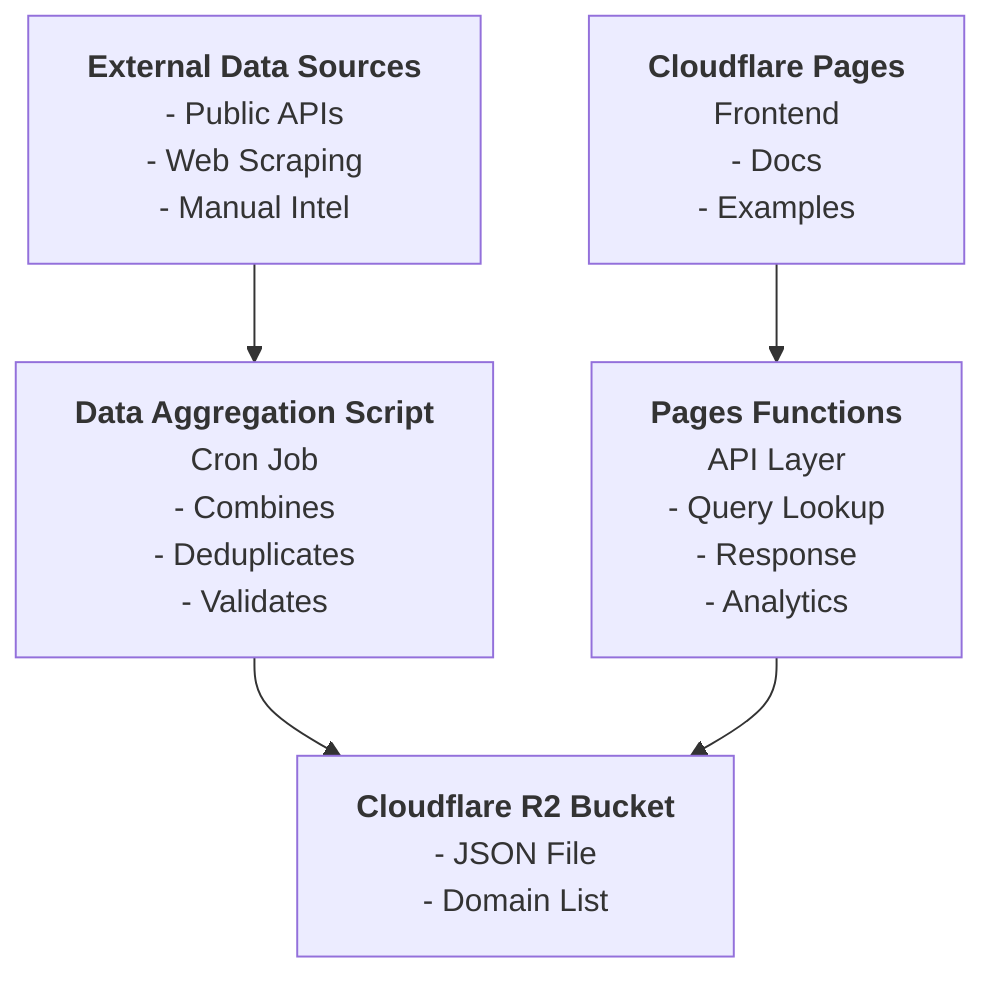
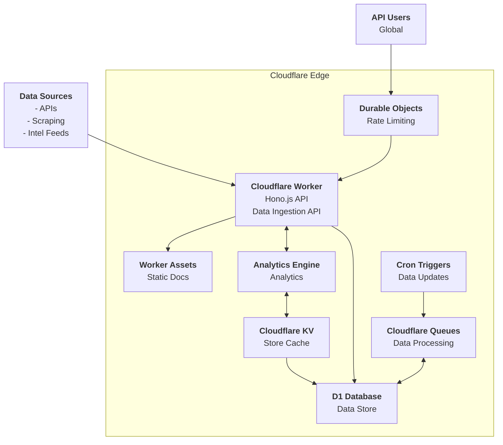
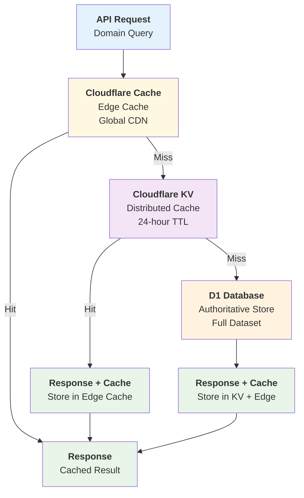

Throwaway email services present a unique challenge. They serve legitimate privacy and testing needs, but are frequently exploited by bad actors for fraud, fake accounts, and credential testing.

That's why I built [**throwaway.cloud**](https://throwaway.cloud) — a detection service that helps businesses identify disposable email domains while respecting user privacy. It delivers fast, accurate results without tracking or surveillance.

---

## The Challenge of Ethical Detection

Building a detection service today requires balancing security needs with privacy principles. The goal is providing useful intelligence without crossing into surveillance.

### Understanding Disposable Email Use Cases

Throwaway email services serve both legitimate and malicious purposes:

**Legitimate Use Cases**
- Avoiding spam and marketing emails  
- Creating test accounts for development  
- Accessing gated content anonymously  
- Conducting security research  

**Malicious Use Cases**
- Creating fake accounts for fraud and abuse  
- Validating stolen card data  
- Inflating product reviews  
- Repeatedly abusing free trials or bonuses  
- Sending spam or phishing emails  

### Balancing Privacy and Security

The goal isn't to eliminate throwaway email services, but to help businesses make informed risk assessments:

- **Privacy by Design**: We detect services, not users. No tracking, no profiling, no personal data collection.
- **Clear Binary Responses**: Our API provides definitive yes/no classifications, leaving implementation decisions to you.
- **Transparent Methods**: All detection criteria and data sources are documented for complete transparency.
- **Focused Approach**: No behavioral scoring, user fingerprinting, or unnecessary data collection.  

### Classification Methodology

Our classification process is systematic and evidence-based. Domains are flagged as disposable when they meet specific criteria:

**Service Indicators**
- Domain explicitly advertises temporary or disposable email services
- Provides public, unauthenticated inbox access
- Markets itself for bypassing email verification systems

**Technical Patterns**
- MX records pointing to known throwaway infrastructure
- Automated generation of unlimited email addresses
- No legitimate business purpose beyond email forwarding

**Behavioral Evidence**
- Consistent appearance in fraud reports across multiple platforms
- Usage patterns focused on account creation rather than communication
- Verified abuse reports from legitimate service providers

**Exclusion Criteria**
- Privacy-focused email providers requiring legitimate registration
- Domains used for legitimate development and testing purposes
- Isolated incidents without established patterns of abuse

---

## V1: Static Architecture

The initial implementation prioritized simplicity and reliability through a lightweight, static approach.

### Key Components

**Data Collection Pipeline**
* **External Sources**: Automated collection from public APIs, community threat feeds, and security research databases
* **Web Scraping**: Systematic harvesting of disposable email directories and service listings
* **Manual Intelligence**: Curated additions from abuse reports and platform observations

**Processing Engine**
* **Aggregation Script**: Cron-scheduled job combining all intelligence sources into a unified dataset
* **Validation**: Domain verification, MX record checks, and service availability testing
* **Deduplication**: Intelligent merging to eliminate overlaps across different data sources
* **Quality Control**: Filtering false positives and maintaining high-confidence classifications

**Storage & Distribution**
* **Cloudflare R2**: Single JSON file containing the complete domain database for fast global access
* **Optimized Format**: Compressed, indexed data structure for sub-second lookup times

**API Infrastructure**
* **Cloudflare Pages**: Static documentation and developer resources
* **Pages Functions**: Serverless API endpoints handling domain queries with built-in caching
* **Basic Analytics**: Request logging and usage metrics for service monitoring

### Scaling Challenges

While V1 served well as an MVP, increased adoption revealed performance and data quality limitations:

**Performance Bottlenecks**
- Response times hitting 200-400ms during peak usage
- Single JSON file became unwieldy as our dataset grew to 50,000+ domains
- Basic caching couldn't handle the growing request volume efficiently
- Static updates meant stale data between batch refreshes

**Data Quality Issues**
- Manual validation couldn't keep pace with new throwaway services
- False positives from domains that had stopped offering disposable email
- No real-time verification of domain status or MX records
- Limited intelligence sources due to batch processing constraints

These limitations necessitated a fundamental architectural redesign to meet growing performance and accuracy requirements.

---

## V2: Distributed Serverless Architecture

The redesigned system delivers real-time intelligence, event-driven updates, and comprehensive analytics while maintaining performance and privacy standards.

### Core Technologies

* **Hono.js**: Fast, TypeScript-first HTTP framework powering the API
* **Cloudflare Workers**: Handle requests at the edge, with low-latency detection and data access
* **Cloudflare Queues**: Asynchronous data ingestion and evaluation
* **KV Store**: Sub-millisecond global caching for frequently queried domains
* **D1 (SQLite)**: Persistent data store for metadata, provenance, and analytics
* **Durable Objects**: Global rate limiting with persistent state
* **Analytics Engine**: Anonymous pattern tracking for emerging threats
* **Cron Triggers**: Automated re-evaluation of inactive domains and infrastructure changes

---

## Detection Intelligence Pipeline

### Multi-Source Data Integration

The platform aggregates intelligence from diverse sources:

* Public APIs of known services
* Scraped lists and open directories
* Real-world abuse data and fraud indicators
* Pattern analysis (e.g. MX changes, entropy, repetition)
* Community reporting and researcher submissions

### Binary Classification Approach

Unlike scoring systems that return probability ranges, throwaway.cloud provides definitive binary classifications.

Benefits of this approach:

* **Simplified Integration**: Eliminates threshold configuration complexity
* **Higher Confidence**: Each classification represents high-confidence determination
* **Clear Actionability**: Unambiguous results enable consistent policy application

---

## Performance and Privacy

### Response Time Optimization

* 95th percentile response time: **45ms** (down from 400ms)
* KV cache serves most requests in under 10ms
* D1 database provides authoritative data for cache misses

### Caching Strategy

**Multi-Tier Performance:**
* **Tier 1**: Cloudflare Edge Cache (~1ms response time)
* **Tier 2**: KV Store (~10ms response time, 24-hour TTL)  
* **Tier 3**: D1 Database (~50ms response time, authoritative data)

### Privacy-First Design

* No user tracking, IP collection, or personal identifiers
* Anonymous usage pattern analysis for threat detection only
* Zero collection, storage, or sharing of personally identifiable information

### Intelligent Rate Limiting

* Global per-user limits implemented via Durable Objects
* Informative error responses with usage and reset timing

---

## Performance Improvements

The serverless migration delivered measurable improvements across key metrics:

**🎯 Enhanced Accuracy**  
Improved validation processes significantly reduce false positive rates.

**⚡ 89% Response Time Improvement**  
Sub-50ms responses enable real-time integration without user experience impact.

**🔄 Real-Time Intelligence**  
Minute-level detection of new threats versus hour-level batch updates.

**💰 80% Infrastructure Cost Reduction**  
Operational efficiency enables expanded free tier access.

---

## Use Cases in the Wild

**🛒 Stop E-commerce Fraud Before It Starts**  
Catch discount abuse, fake reviews, and bot accounts at signup. One major retailer reduced fraudulent registrations by 73% after integrating throwaway.cloud into their checkout flow.

**🏦 Strengthen Financial Onboarding**  
Meet compliance requirements while reducing friction for legitimate users. Credit unions and fintech startups use our API to flag high-risk signups without blocking privacy-conscious users.

**🛡️ Platform Protection That Scales**  
From social networks to SaaS platforms—identify suspicious accounts before they can spam, manipulate reviews, or abuse free trials. Works seamlessly with existing fraud prevention stacks.

**⚡ Integration in Minutes, Not Months**  
Simple REST API with comprehensive docs. Most developers integrate throwaway detection in under an hour. Free tier includes 10,000 monthly requests—enough for most startups to get started.

---

## Looking Ahead

As a side project built during evenings and weekends, throwaway.cloud's future depends on finding time between day jobs and life. But here's what I'm dreaming about:

### The Fun Stuff I Want to Build

**🤖 Smarter Detection (When I Feel Like Learning ML)**  
Maybe I'll finally dive into those machine learning courses gathering dust in my bookmarks. Pattern recognition sounds fun, and I've always wondered if I could build something that spots new throwaway services before they hit the usual lists.

**🕵️ Intelligence Expansion (If I Get Bored on Weekends)**  
Setting up honeypots could be entertaining. There's something appealing about creating fake services just to see what bad actors do with them. Plus, I've been meaning to automate more of the discovery process—currently too much is still manual.

**🔒 Privacy-First Features (Because It Matters)**  
Zero-knowledge architecture isn't just buzzword bingo—it's the right thing to do. I want to explore differential privacy for analytics and maybe build public audit logs so anyone can see exactly what data I'm collecting (spoiler: not much).

**📊 Better Analytics (For My Own Curiosity)**  
I'm curious about usage patterns and emerging threats, but in a way that doesn't compromise user privacy. Maybe anonymous trend analysis or public threat intelligence feeds.

### Reality Check

Will I build all of this? Probably not. Will I build *some* of this when I'm supposed to be doing other things? Almost certainly. 

The beauty of a personal project is following whatever interests me most at 11 PM on a Tuesday.

---

## Building a Better Internet (Without Being Evil)

After a decade fighting bad actors at Cloudflare, I built throwaway.cloud around a simple idea: you can have security without surveillance.

I don't track users. I don't sell data. I just help platforms make smarter decisions about email addresses.

The goal is simple:

* Help businesses stop fraud without creeping on users
* Share threat intelligence to make everyone safer
* Keep privacy tools available for legitimate uses
* Make security accessible to companies that can't afford enterprise solutions

---

**Interested in integrating throwaway email detection?**
Visit [**throwaway.cloud**](https://throwaway.cloud) for free API access and full documentation.

**Questions or ideas?**
I’m always interested in discussing detection, privacy, and practical security tooling.
